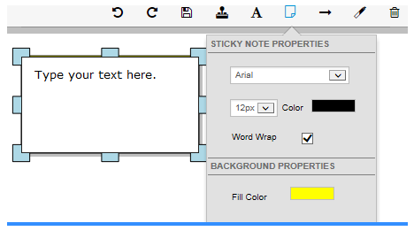

<p align="center">
<a href="https://tycherisk.co"></a><br/>
<b>Simple utility for extracting annotation data from proprietary Vertafore binaries</b><br/>
</p>

## Vertafore ImageRight binaries

[Vertafore ImageRight](https://www.vertafore.com/products/imageright) is an enterprise content management and workflow software package for the insurance industry. ImageRight allows underwriters, claims adjusters, and others to:

 - Store documents such as printed letters, statements, emails, spreadsheets, memos, etc. in an image database
 - Organize multiple documents into folders
 - Explore and Retrieve select documents
 - Manage granular permissions
 - Annotate and modify the images
 - View images
 - Etc. 

Insurers collect terabytes of documents in ImageRight, and it functions much like a digital filing cabinet. It is meant to serve as a dashboard + database for insurers to store and retrieve documents by hand. Because ImageRight stores documents in image format [TIFF](https://www.adobe.io/content/udp/en/open/standards/TIFF/_jcr_content/contentbody/download/file.res/TIFF6.pdf), no structured data is readily available, and natural language processing techniques require OCR. 

### ImageRight Annotations

ImageRight allows users to hand [annotate a page](https://help.vertafore.com/agencyplatformws/content/worksmart/annotateapage.htm). 



Computational processing of the ImageRight database was never an intended use-case, so building machine learning models based on ImageRight data requires extracting structured data from images of forms, metadata, and raw text language. We hypothesize that the hand annotations that underwriters, claims adjusters, and investigators apply to images in Vertafore are at least as predictive as the contents themselves. Additionally, these annotations are applied within the ImageRight software, so they are not entire embedded in the image, requiring a lossy OCR step. They are however, stashed in an undocumented, proprietary binary format stored on the server with the extension ANN. 

This simple utility parses the binary file looking for text annotations marked by a specific binary prefix _0xFF01_ and returns the plain text. 

## Usage

The filesystem from the server must be retrieved, and the mapping between files and insurance policies must be preserved. Once you have a .ANN file, you can call this script to extract the annotation text. This text can then be further processed using any number of NLP & machine learning techniques. 

```bash
$ file 00D4FC0800000002.ANN 
00D4FC0800000002.ANN: data

$ python ann_extract.py 00D4FC0800000002.ANN out.txt
I have the original at my desk... will file once you have approved. 
3/20/2013<name>
we are good.  Ok to file it.

<name>  3/21/2013
```